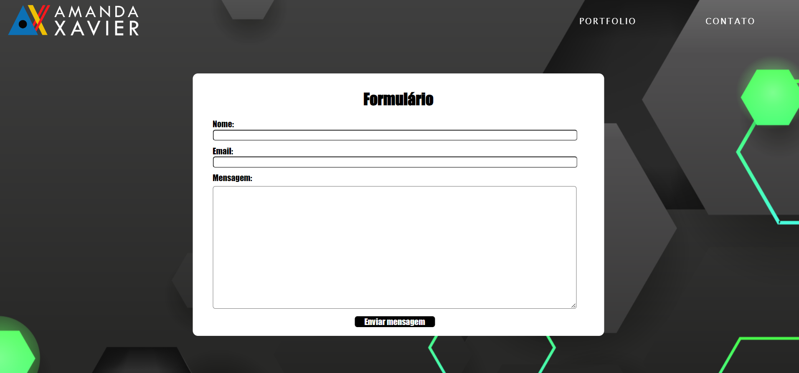

# 🧑‍💻 Exercício 
## Criar uma página HTML & CSS

Atividade de implementação do HTML e CSS da aula de Desenvolvimento Web – Client-Side com a professora Lais Reis.

O projeto ainda não se encontra responsivo, vou adaptando e acrescentando conteúdos aos poucos.

## Autores

- [@amandaxavierdeaguiar](https://github.com/amandaxavierdeaguiar)